# 全局多级 KV Cache

## 背景

长上下文推理在自回归解码过程中需要持续读取历史 KV Cache。随着模型规模和上下文窗口增长，设备显存容量和带宽会成为主要瓶颈。仅使用 Device Cache 时，即使相同前缀已经被其他请求或其他 xLLM 实例计算过，冷请求仍然需要重新执行 Prefill。

xLLM 将 Device Prefix Cache 扩展为三级缓存：

| 层级 | 用途 | 生命周期 |
|---|---|---|
| Device HBM | 当前 Forward 使用的最低延迟 KV | 设备本地 |
| Host Cache | Pinned CPU 内存中的传输缓冲区和可复用 Host Prefix Cache | xLLM 进程 |
| Mooncake Store | 在多个 xLLM 进程以及进程重启之间共享的分布式 KV 对象 | Store 集群 |

请求首先探测 Host Prefix Cache。缺失的完整 Block 可以从 Mooncake Store 读取到预分配的 Host Block，再按层恢复到 HBM，从而跳过已命中前缀的重复计算。已完成的 HBM Block 会异步写回 Host，随后写入 Mooncake Store。

当前实现由 `HierarchyBlockManagerPool` 管理 Block 的分配、挂载和生命周期，由 `HierarchyKVCacheTransfer` 统一执行 Host↔Device 传输，并由每个 Worker 内的一个 `KVCacheStore` 访问 Mooncake Store。一个 Store 客户端可以同时管理主模型、投机解码 Draft 模型以及同一模型中的多种 `BlockType`。

## 架构

部署中可以包含以下组件：

- **etcd**：注册计算实例并同步服务元数据。
- **xLLM Service**：路由请求并管理 Fused 或 PD 分离实例。
- **HierarchyBlockManagerPool**：探测 Device/Host Prefix Cache，生成 G2H、H2D 和 D2H2G 计划，并在异步任务完成后发布或释放 Block。
- **HierarchyKVCacheTransfer**：统一注册主模型与 Draft 模型缓存域，创建 Host Cache，并执行 Host↔Device 拷贝。
- **KVCacheStore**：将逻辑 Block 映射为一个或多个 Mooncake 对象，执行批量读取、写入和逻辑命中聚合。
- **xLLM Worker**：持有 Device/Host KV Cache、`HierarchyKVCacheTransfer` 和 `KVCacheStore`，并执行推理。
- **Mooncake Store**：提供分布式、可跨进程复用的 KV 对象存储层。

服务级整体架构如下：


## 缓存布局与 BlockType

`HierarchyBlockManagerPool` 使用 `CompositeBlockManager` 把一个请求的多个缓存池组合起来。当前层级缓存支持以下三种布局：

| 布局 | 设备/Host `BlockType` | 完整 copy unit / 写回边界 |
|---|---|---|
| `FLAT_KV` | `KV` | 一个完整 KV block |
| `FLAT_KV_LINEAR` | `KV`、`LINEAR` | Qwen3.5/GLM5.3 每完成 `max_tokens_per_chunk_for_prefill` 个 token 形成一个 checkpoint/copy unit |
| `SWA_COMPRESSED` | `SWA`、`C4`、`C128` | DeepSeek-V4 每个 unit 固定为 `1 SWA + 32 C4 + 1 C128`，共 34 条传输信息 |

`KV` 是普通/Qwen 等模型的注意力缓存。`SWA`、`C4` 和 `C128` 是 DeepSeek-V4 类压缩缓存的三个独立池：`C4` 和 `C128` 必须完整，`SWA` 只需要覆盖每个可恢复 `C128` 检查点之前的窗口。Decode 侧的 `SWA` Host leaf 仅用于写回，不参与前缀探测或 Host 恢复。

启用线性注意力（GDN/KDA）时，KV 和 recurrent state 使用独立的 Host block 池，两个池分别按 `host_blocks_factor` 扩容。`LINEAR` 的 Host 传输只保存已提交状态：设备上的 Conv 历史只复制前 3 行，SSM 只复制当前 slot 的第一个 checkpoint 行；Prefill 最多保留 `[restore, live]` 两个 rolling slot。`EMBEDDING` 是投机解码的 per-sequence embedding slot，不属于层级 KV transfer，也不会生成 Mooncake Store 对象。

需要注意，当前 `HierarchyKVCacheTransfer` 已支持 `LINEAR` 的 H2D 和 D2H2G 拷贝，但 `HierarchyBlockManagerPool` 的 Mooncake G2H 预取单元仍只完整实现了 `FLAT_KV` 和 `SWA_COMPRESSED`。因此 `FLAT_KV_LINEAR` 可以使用 Host 传输能力以及符合条件的 checkpoint 写回，但不应依赖当前版本的 Store 跨进程前缀预取；LINEAR 的 Store admission 和完整 rolling-state 生命周期仍待补齐。

## 统一缓存域与 Store 键

`HierarchyKVCacheTransfer` 支持注册多个缓存域。普通推理只注册主模型缓存域；投机解码会把主模型和 Draft 模型注册到同一个 Transfer 实例，并共享同一个 Host 传输布局与 `KVCacheStore`：

| 缓存域 | `CacheRole` | Store `key_component` |
|---|---|---|
| 主模型 | `TARGET` | 固定为 `main` |
| 内置 Draft | `DRAFT` | `spec_draft::<algorithm>::embedded` |
| 独立 Draft 模型 | `DRAFT` | `spec_draft::<algorithm>::<目录名>::<规范化路径摘要>` |

Store 初始化时会按 `BlockType` 构建索引。每个支持该 `BlockType` 的缓存域都会形成一个独立物理对象。例如，主模型和 Draft 模型都包含 `BlockType::KV` 时，一个逻辑 KV Block 会对应两个 Store 对象；若某个 `BlockType` 只存在于主模型，则只生成主模型对象。

当前对象键使用 `xllm-kv-v3` 命名空间。`model_id` 和 `key_component` 使用长度前缀编码，哈希字段以 128 位二进制值追加。概念上由以下字段组成：

```text
非 MLA：xllm-kv-v3:<model_id>:<key_component>:<tp_size>:<tp_rank>
                   :<kv_split_size>:<kv_split_rank>:<block_type>
                   :<schema_hash><block_hash>

MLA：   xllm-kv-v3:<model_id>:<key_component>:mla
                   :<kv_split_size>:<kv_split_rank>:<block_type>
                   :<schema_hash><block_hash>
```

- `model_id` 是主模型命名空间，主模型和 Draft 模型对象都会包含它。
- `key_component` 区分主模型、投机算法和 Draft 模型来源。
- 非 MLA 缓存使用 `tp_size`、`tp_rank`、`kv_split_size`、`kv_split_rank` 和 `block_type` 隔离不同并行拓扑、Rank、KV 分片和缓存类型。这里的 `tp_size`/`tp_rank` 是当前 Store client 使用的有效本地 TP 拓扑，不一定等于全局进程 rank。
- MLA KV Cache 使用固定的 `mla` 标识，不包含 `tp_size` 或 `tp_rank`；`kv_split_size` 和 `kv_split_rank` 仍然会进入对象键。`kv_split_size=1` 时 KV 未切分，所有 Rank 读取同一个对象且只有 TP Rank 0 写入；启用 KV split 后，每个 KV split rank 读写自己的 Store 对象。
- `kv_split_size` 是有效的 KV 分片数，`kv_split_rank` 是当前 Worker 所属的分片编号。配置为 `0` 时有效值沿用 `cp_size`；配置为 `1` 时不切分 KV，`kv_split_rank` 固定为 `0`。
- `schema_hash` 由并行模式、`BlockType` 以及单个 Block 内各 Tensor 的 role、dtype 和除 Host Block 数量之外的 shape 生成。因此只调整 `host_blocks_factor` 不会改变对象键；改变 KV/LINEAR/压缩布局、dtype、role 或单 Block shape 会自动进入新的键空间。
- `block_hash` 是对应逻辑 Block 的 128 位内容哈希；对 `LINEAR` 则对应已提交 recurrent checkpoint 的状态哈希。

Store API 以“逻辑 Block”为上层接口，以“缓存域对象”为物理请求。只有同一 Worker 内该逻辑 Block 对应的**全部物理对象**都读取成功，该 Worker 才会报告命中；随后 `PrefetchResult` 会对本次 DP rank 涉及的本地 Worker group 执行逻辑 AND。该 group 的大小是 `world_size / dp_size`，其中实际包含哪些 TP/CP worker 由后端拓扑决定，不应简单等同于 TP rank。启用 KV split 时，不同 `kv_split_rank` 使用不同对象键，不能混为同一份缓存。最终可发布的 Store 命中必须同时满足“所有缓存域完整”和“所需 Worker group 完整”。

### KV split 与 Store

KV split 与 Mooncake Store 可以同时启用。Store 会把每个逻辑 Block 按 `kv_split_size` 和 `kv_split_rank` 映射到独立的对象键，因此不同 KV shard 不会互相覆盖，也不会把一个 shard 的命中误判为完整 KV。Prefill 从 Store 恢复时，只有本次请求所需的 Worker group 和所有注册缓存域都命中，Block 才会挂载到 Host Prefix Cache。

对 MLA 缓存，未切分时仍由 TP Rank 0 负责写入公共对象；切分后各 KV split rank 都会写入自己的对象。对投机解码，主模型和 Draft 模型仍然使用独立的 `key_component`，每个缓存域还会分别按 KV split 拆分，因此缺少任一 Draft shard 都会使对应逻辑 Block 视为未命中。

`kv_split_size` 的可用取值由后端、模型和并行拓扑校验决定。常规 CP 配置下，`K` 应为正数并满足该后端要求（通常为 `cp_size` 的因子）；`0` 表示沿用 `cp_size`，`1` 表示不切分。如果期望不同实例复用同一批 Store 对象，它们必须使用一致的模型身份、缓存布局和有效 split 拓扑；不同 split 拓扑会进入不同键空间，不会交叉命中。

## Block 流转

对 `FLAT_KV` 和 `SWA_COMPRESSED`，Fused 实例以及 PD 分离中的 Prefill 实例使用完整的 Mooncake 准入、Host 恢复和写回流程。Decode 也保持 Store 开启，用于自身的 Host/Mooncake 写回；但 Decode 的请求准入仍然只探测 Device Prefix。`FLAT_KV_LINEAR` 当前只保证 Host↔Device 传输和符合条件的 checkpoint 写回，不能套用下图的完整 Store 准入流程。启用投机解码时，下图中的一次逻辑 Block 操作会同时覆盖主模型和 Draft 模型中支持该 `BlockType` 的缓存域。

调度侧和执行侧的职责是分开的：

- `HierarchyBlockManagerPool` 维护 `load_block_transfer_infos_` 和 `offload_block_pair_queues_`，负责 Block 所有权、Host 目标 Block 预留，以及完成回调中的 publish/free；它只生成和记录传输计划，不执行物理拷贝。
- Worker 内的 `HierarchyKVCacheTransfer` 执行真实的 Host↔Device 分层拷贝和 Store get/put，创建 copy stream、event、`LayerSynchronizer`，并保存 `batch_id -> HostKVLoadHandle`。D2H 结果通过 future 返回调度侧，由 BlockManager 汇总后更新 Host Prefix Cache。

写回不是等到请求 `deallocate` 时一次性触发。每轮 Forward 更新 HBM token cursor 后，下一轮 `allocate/grow` 会发布上一轮刚完成的 copy unit，并立即收集新的 D2H2G mapping：普通模型每满一个 KV block 收集一次，DeepSeek-V4 每满一个 `1 SWA + 32 C4 + 1 C128` 复合 unit 收集一次，Qwen3.5/GLM5.3 每满一个 chunked-prefill stride 收集一次。`deallocate` 只收集最后尚未入队的完整 unit 并释放 sequence。

下图箭头使用实现中的函数名；状态变化、线程关系和数据语义放在 `Note` 中说明。

```mermaid
sequenceDiagram
    autonumber

    participant Client as Client / xLLM Service
    participant Scheduler as ContinuousScheduler
    participant BlockMgr as HierarchyBlockManagerPool
    participant Engine as LLMEngine
    participant Remote as RemoteWorker
    participant Channel as CommChannel
    participant Service as WorkerService
    participant Result as PrefetchResult
    participant Worker as WorkerImpl / HierarchyKVCacheTransfer
    participant Copy as HostKVTransfer
    participant Store as KVCacheStore / Mooncake Store
    participant Cache as Host Cache / Device HBM

    rect rgb(235, 245, 255)
        Note over Client,Store: 阶段一：请求准入与 Mooncake Store 预取

        Client->>Scheduler: ContinuousScheduler::add_request()
        Scheduler->>BlockMgr: HierarchyBlockManagerPool::prefetch_from_storage()
        BlockMgr->>BlockMgr: CompositeBlockManager::probe_prefix_cache()
        BlockMgr->>BlockMgr: BlockManager::allocate_for_prefetch()
        BlockMgr->>BlockMgr: build_prefetch_request()
        Note right of BlockMgr: Host 命中直接保留；holes 预留为 G2H 目标

        Note over BlockMgr,Store: 若 Host 已覆盖全部 prefix，则跳过 Store RPC
        BlockMgr->>Engine: LLMEngine::prefetch_from_storage()
        Engine->>Result: PrefetchResult::PrefetchResult()

        par 本次 DP rank 涉及的所有本地 Worker 并行
            Engine->>Remote: RemoteWorker::prefetch_from_storage()
            Remote->>Channel: CommChannel::prefetch_from_storage()
            Channel->>Service: WorkerService::PrefetchFromStorage()
            loop WorkerPrefetchSession 的每个 batch
                Service->>Service: WorkerPrefetchSession::run_batch()
                Service->>Worker: WorkerImpl::prefetch_kv_blocks()
                Worker->>Worker: HierarchyKVCacheTransfer::prefetch_kv_blocks()
                Worker->>Store: KVCacheStore::batch_get_with_status()
                Store-->>Worker: std::vector<uint8_t>
                Worker-->>Service: std::vector<uint8_t> logical_hits
                Service-->>Channel: uint8_t prefix_hit_units (brpc stream)
                Channel->>Result: PrefetchResult::record_batch_result()
                Result-->>Channel: PrefetchControl
                Channel-->>Service: PrefetchControl (brpc stream)
            end
            Service-->>Channel: brpc::StreamClose()
            Channel->>Result: PrefetchResult::mark_worker_ended()
        end

        Result-->>BlockMgr: DoneCallback(common_hit_units)
        Note right of Result: ClientStreamReceiver 在调度进程调用 PrefetchResult；<br/>common_hit_units 是所有参与 Worker 连续命中 unit 数的最小值
        BlockMgr->>BlockMgr: finalize_prefetch()
        Note right of BlockMgr: publish 命中 blocks，释放 miss blocks，mount Host state
        BlockMgr-->>Scheduler: PrefetchDoneCallback(request)
        Scheduler->>Scheduler: ContinuousScheduler::enqueue_ready_request()
    end

    rect rgb(240, 255, 240)
        Note over Scheduler,Cache: 阶段二：Host KV 恢复到 HBM 并执行 Forward

        Scheduler->>BlockMgr: HierarchyBlockManagerPool::allocate()
        BlockMgr->>BlockMgr: CompositeBlockManager::allocate_sequence(sequence, num_tokens)
        BlockMgr->>BlockMgr: CompositeBlockManager::allocate_sequence(sequence, host_state, num_tokens)
        BlockMgr->>BlockMgr: collect_load_block_transfer_infos()
        Note right of BlockMgr: H2D mapping 保存在 load_block_transfer_infos_

        Scheduler->>BlockMgr: HierarchyBlockManagerPool::transfer_blocks(batches)
        BlockMgr->>Engine: LLMEngine::transfer_kv_blocks(dp_rank, batch_id, infos)
        Engine->>Remote: RemoteWorker::transfer_kv_blocks(batch_id, infos)
        Remote->>Channel: CommChannel::transfer_kv_blocks(batch_id, infos)
        Channel->>Service: WorkerService::TransferBlocks()
        Service->>Worker: WorkerImpl::transfer_kv_blocks(batch_id, infos)
        Worker->>Worker: HierarchyKVCacheTransfer::transfer_kv_blocks()
        Worker->>Copy: BasicHostKVTransfer::prepare_load() / CompactHostKVTransfer::prepare_load()
        Note right of Worker: HostKVLoadHandle 保存在 load_handles_[batch_id]
        Worker->>Worker: load_threadpool_->schedule(load_from_host)
        Worker-->>Service: uint32_t info_count
        Service-->>Channel: TransferStatus.success_cnt
        Note over Remote,Service: RemoteWorker::threadpool_ 先执行 H2D 注册 RPC，<br/>再执行随后入队的 step_remote_async()

        par load_threadpool
            Worker->>Worker: HierarchyKVCacheTransfer::load_from_host()
            Worker->>Copy: HostKVTransfer::load(request, handle)
            Copy->>Copy: BasicHostKVTransfer::load_impl() / CompactHostKVTransfer::load_impl()
            Note over Copy,Cache: H2D copy stream 按 layer range 记录 LayerSynchronizer ready event
        and Forward executor
            Scheduler->>Engine: LLMEngine::step(batches)
            Engine->>Remote: RemoteWorker::step_remote_async(input)
            Remote->>Channel: CommChannel::execute_model_async(input, promise)
            Channel->>Service: WorkerService::ExecuteModel()
            Service->>Worker: WorkerImpl::step_async(input)
            Worker->>Worker: WorkerImpl::set_hierarchy_layer_synchronizer()
            Worker->>Worker: HierarchyKVCacheTransfer::set_layer_synchronizer(params)
            opt Worker owns recurrent cache
                Worker->>Worker: WorkerImpl::prepare_linear_state_cache(params)
                Worker->>Worker: ModelInputParams::synchronize_all_layers()
                Note right of Worker: LINEAR state restore 要求全部 H2D events<br/>在 restore_linear_state_slots() 前完成
            end
            loop 模型的每一层
                Worker->>Worker: ModelInputParams::synchronize_layer(layer_idx)
                Note right of Worker: 等到该 layer range 的 event 后<br/>才进入本层 attention 并读取 HBM KV
            end
            Worker-->>Service: optional<ForwardOutput>
            Service-->>Channel: proto::ForwardOutput
            Channel-->>Remote: RawForwardOutput
            Remote-->>Engine: SemiFuture<optional<RawForwardOutput>>
        end

        Note right of Worker: target/draft mapping 共用同一 batch_id 和 synchronizer
    end

    rect rgb(255, 245, 235)
        Note over Scheduler,Store: 阶段三：Prefill/Decode 循环中按 copy unit 增量写回

        loop 每轮 Forward 后继续 grow
            Note over Scheduler,Cache: Forward N 已完成并更新 HBM token cursor
            Scheduler->>BlockMgr: HierarchyBlockManagerPool::allocate()
            BlockMgr->>BlockMgr: CompositeBlockManager::allocate_sequence(sequence, num_tokens)
            Note right of BlockMgr: allocate_sequence() 在 grow 前后调用<br/>cache_full_blocks_for_sequence()
            BlockMgr->>BlockMgr: CompositeBlockManager::allocate_sequence(sequence, host_state, num_tokens)
            BlockMgr->>BlockMgr: collect_offload_pairs()
            Note right of BlockMgr: 新完整 unit 的 HBM→Host pair 进入<br/>offload_block_pair_queues_

            Scheduler->>BlockMgr: HierarchyBlockManagerPool::transfer_blocks(batches)
            BlockMgr->>BlockMgr: transfer_offload_blocks()
            BlockMgr->>Engine: LLMEngine::transfer_kv_blocks(dp_rank, infos)

            loop 所有参与执行的本地 Worker
                Engine->>Remote: RemoteWorker::transfer_kv_blocks(infos)
                Remote-->>Engine: SemiFuture<uint32_t>
            end
            Engine-->>BlockMgr: vector<SemiFuture<uint32_t>>
            BlockMgr->>BlockMgr: folly::collectAll(...).thenValue()

            par RemoteWorker copy_threadpool_ / Worker executor
                Remote->>Channel: CommChannel::transfer_kv_blocks(infos, promise)
                Channel->>Service: WorkerService::TransferBlocks()
                Service->>Worker: WorkerImpl::transfer_kv_blocks(batch_id, infos)
                Note right of Worker: D2H2G 在 WorkerImpl 的单线程 executor 中<br/>排在上一轮 Forward 之后执行
                Worker->>Worker: HierarchyKVCacheTransfer::transfer_kv_blocks()
                Worker->>Worker: HierarchyKVCacheTransfer::offload()
                Worker->>Worker: HierarchyKVCacheTransfer::offload_to_host()
                Worker->>Copy: HostKVTransfer::offload(request)
                Copy->>Copy: BasicHostKVTransfer::offload_impl() / CompactHostKVTransfer::offload_impl()
                Note over Copy,Cache: HostKVTransfer::offload() 成功返回时<br/>Host tensors 已可供 CPU / Store 访问
                Worker->>Store: KVCacheStore::batch_put()
                Store-->>Worker: uint32_t put_count
                Note right of Store: 未切分 MLA 的非 0 TP rank 在 batch_put() 内跳过；<br/>其他 Worker 写入各自对象或 KV shard
                Note right of Worker: BatchPut 是 best-effort<br/>部分失败不改变 D2H 成功状态
                Worker-->>Service: uint32_t block_count
                Service-->>Channel: TransferStatus.success_cnt
                Channel-->>Remote: folly::Promise<uint32_t>::setValue()
            end

            Note right of BlockMgr: 检查 Worker 数量与每个返回的 block count
            BlockMgr->>BlockMgr: CompositeBlockManager::deallocate(device_blocks)
            BlockMgr->>BlockMgr: finalize_host_blocks(copy_ok, ...)
            Note right of BlockMgr: copy_ok 时先 cache_blocks()；失败不发布<br/>两条路径最终都 deallocate Host 持有引用
        end

        opt sequence 完成或被取消
            Scheduler->>BlockMgr: HierarchyBlockManagerPool::deallocate()
            BlockMgr->>BlockMgr: CompositeBlockManager::cache_full_blocks_for_sequence()
            BlockMgr->>BlockMgr: collect_offload_pairs()
            BlockMgr->>BlockMgr: CompositeBlockManager::deallocate_for_sequence(sequence, host_state)
            BlockMgr->>BlockMgr: CompositeBlockManager::deallocate_for_sequence(sequence)
            BlockMgr->>BlockMgr: Sequence::reset()
            Note right of BlockMgr: 只补收最后尚未入队的完整 unit；<br/>队列继续持有 D2H 所需 Block 引用
            Scheduler->>BlockMgr: HierarchyBlockManagerPool::transfer_blocks()
            BlockMgr->>BlockMgr: transfer_offload_blocks()
            Note over Scheduler,BlockMgr: ContinuousScheduler::prepare_batch() 在空 batch 时<br/>也调用无参 transfer_blocks()
        end
    end
```



## 投机解码缓存

启用投机解码并配置 Host Cache 时，`SpeculativeWorkerImpl` 会让 Target Worker 和 Draft Worker 复用同一个 `HierarchyKVCacheTransfer`。两个缓存域必须共享同一条 producer stream，注册完成后再统一创建 Host Cache、Host 传输器和 `KVCacheStore`。

统一缓存域带来以下行为：

- G2H 预取会同时读取主模型和 Draft 模型对象。任一对象缺失时，该逻辑 Block 都按 miss 处理，避免只恢复主模型而让 Draft 状态不完整。
- H2D 和 D2H 请求会分别生成 `target_mappings` 与 `draft_mappings`，但在同一 `batch_id` 和 Layer Synchronizer 下推进。
- D2H2G 写回会先把两个缓存域复制到各自 Host Cache，再由同一个 `KVCacheStore` 写入各自键空间。
- Draft 键自动包含投机算法和 Draft 来源。更换 Draft 路径会产生新键；若在原路径原地替换权重，应同时更换 `model_id`。

普通非投机推理仍只注册 `main` 缓存域，行为与此前单域 Store 一致。

## PD 分离

在 PD 分离场景中，Mooncake Store 准入和 Host→HBM 恢复发生在 **Prefill** 实例。Decode 会在 Prefill 开始前预分配目标 Device Block，并且在请求准入时只探测 Device Prefix Cache；Decode 不会 mount Host alias、从 Mooncake 获取 prefix 或调度 Host→Device 恢复。Decode 仍需开启 Store 并配置 Host Cache 容量，用于自身的写回流程。

```mermaid
sequenceDiagram
    autonumber

    participant Client as Client / xLLM Service
    participant PSched as PREFILL DisaggPDScheduler
    participant PBlock as PREFILL HierarchyBlockManagerPool
    participant PEngine as PREFILL LLMEngine
    participant PRemote as PREFILL RemoteWorker / RPC
    participant PResult as PREFILL PrefetchResult
    participant PWorker as PREFILL WorkerImpl / HierarchyKVCacheTransfer
    participant Store as KVCacheStore / Mooncake Store
    participant PCache as PREFILL Host / HBM
    participant DService as DisaggPDService / Impl
    participant DSched as DECODE DisaggPDScheduler
    participant DBlock as DECODE KVCacheManager
    participant DEngine as DECODE LLMEngine
    participant DRemote as DECODE RemoteWorker / WorkerImpl
    participant KVTransfer as KVCacheTransfer
    participant DHBM as DECODE HBM

    rect rgb(235, 245, 255)
        Note over Client,PCache: 阶段一：PREFILL admission 与 Mooncake 恢复

        Client->>PSched: ContinuousScheduler::add_request()
        PSched->>PBlock: HierarchyBlockManagerPool::prefetch_from_storage()
        PBlock->>PEngine: LLMEngine::prefetch_from_storage()
        PEngine->>PRemote: RemoteWorker::prefetch_from_storage()
        PRemote->>PRemote: CommChannel::prefetch_from_storage()
        PRemote->>PWorker: WorkerService::PrefetchFromStorage()
        PWorker->>PWorker: WorkerImpl::prefetch_kv_blocks()
        PWorker->>PWorker: HierarchyKVCacheTransfer::prefetch_kv_blocks()
        PWorker->>Store: KVCacheStore::batch_get_with_status()
        Store-->>PWorker: std::vector<uint8_t>
        PWorker-->>PRemote: uint8_t prefix_hit_units (brpc stream)
        PRemote->>PResult: PrefetchResult::record_batch_result()
        PRemote->>PResult: PrefetchResult::mark_worker_ended()
        PResult-->>PBlock: DoneCallback(common_hit_units)
        PBlock->>PBlock: finalize_prefetch()
        PBlock-->>PSched: PrefetchDoneCallback(request)
        PSched->>PSched: DisaggPDScheduler::enqueue_ready_request()
        Note right of PSched: 请求进入 prefill_request_queue_，<br/>不存在 Scheduler 轮询 Store 结果的步骤
    end

    rect rgb(250, 240, 255)
        Note over PSched,DHBM: 阶段二：先在 DECODE 预分配目标 blocks

        PSched->>PSched: DisaggPDScheduler::dispatch_requests()
        PSched->>DService: DisaggPDService_Stub::AddNewRequests()
        DService->>DService: DisaggPDService::AddNewRequests()
        DService->>DService: DisaggPDServiceImpl::decode_recv_new_requests()
        DService->>DSched: DisaggPDScheduler::try_allocate()
        DSched->>DBlock: KVCacheManager::try_allocate()
        Note over Store,DBlock: DECODE 准入不获取 Host/Mooncake prefix，也不安排 H2D restore<br/>Store 仍为 DECODE 写回保持开启
        DService->>DSched: DisaggPDScheduler::decode_schedule()
        DService-->>PSched: proto::DisaggResponses
        PSched->>PSched: KVCacheState::set_transfer_kv_info()
        PSched->>PSched: KVCacheState::advance_transfer_block_idx()
        PSched->>PSched: KVCacheState::advance_group_transfer_block_idx()
        PSched->>PSched: folly::MPMCQueue::write(request)
        Note right of PSched: cursor 从 D 侧 remote_shared_num 之后开始
    end

    rect rgb(240, 255, 240)
        Note over PSched,DHBM: 阶段三：每个 PREFILL chunk 的 Forward、Host 写回与 P→D 传输

        loop 每个 PREFILL chunk
            PSched->>PBlock: HierarchyBlockManagerPool::allocate()
            PBlock->>PBlock: CompositeBlockManager::allocate_sequence(sequence, num_tokens)
            PBlock->>PBlock: CompositeBlockManager::allocate_sequence(sequence, host_state, num_tokens)
            PBlock->>PBlock: collect_load_block_transfer_infos()
            PBlock->>PBlock: collect_offload_pairs()
            Note right of PBlock: grow 时发布上一轮完成的 copy unit；<br/>H2D/D2H mapping 都保存在 BlockManagerPool

            PSched->>PBlock: HierarchyBlockManagerPool::transfer_blocks(batches)
            opt 存在 H2D mapping
                PBlock->>PEngine: LLMEngine::transfer_kv_blocks(dp_rank, batch_id, infos)
                PEngine->>PRemote: RemoteWorker::transfer_kv_blocks(batch_id, infos)
                PRemote->>PRemote: CommChannel::transfer_kv_blocks(batch_id, infos)
                PRemote->>PWorker: WorkerService::TransferBlocks()
                PWorker->>PWorker: WorkerImpl::transfer_kv_blocks(batch_id, infos)
                PWorker->>PWorker: HierarchyKVCacheTransfer::transfer_kv_blocks()
                PWorker->>PWorker: load_threadpool_->schedule(load_from_host)
                Note over PWorker,PCache: HierarchyKVCacheTransfer::load_from_host() 在 load_threadpool_ 中<br/>调用 HostKVTransfer::load()，执行分层 H2D 并记录 events
            end
            opt 存在上一轮完成的 D2H2G mapping
                PBlock->>PBlock: transfer_offload_blocks()
                PBlock->>PEngine: LLMEngine::transfer_kv_blocks(dp_rank, infos)
                PEngine->>PRemote: RemoteWorker::transfer_kv_blocks(infos)
                PRemote-->>PEngine: SemiFuture<uint32_t>
                PEngine-->>PBlock: vector<SemiFuture<uint32_t>>
                PBlock->>PBlock: folly::collectAll(...).thenValue()
                PRemote->>PRemote: CommChannel::transfer_kv_blocks(infos, promise)
                PRemote->>PWorker: WorkerService::TransferBlocks()
                PWorker->>PWorker: WorkerImpl::transfer_kv_blocks(batch_id, infos)
                PWorker->>PWorker: HierarchyKVCacheTransfer::offload()
                PWorker->>PWorker: HierarchyKVCacheTransfer::offload_to_host()
                Note over PWorker,PCache: HostKVTransfer::offload() 在 Worker 执行分层 D2H
                PWorker->>Store: KVCacheStore::batch_put()
                PWorker-->>PRemote: uint32_t block_count
                PRemote-->>PBlock: folly::Promise<uint32_t>::setValue(block_count)
                PBlock->>PBlock: CompositeBlockManager::deallocate(device_blocks)
                PBlock->>PBlock: finalize_host_blocks(copy_ok, ...)
            end

            PSched->>PEngine: LLMEngine::step(batches)
            PEngine->>PRemote: RemoteWorker::step_remote_async(input)
            PRemote->>PRemote: CommChannel::execute_model_async(input, promise)
            PRemote->>PWorker: WorkerService::ExecuteModel()
            PWorker->>PWorker: WorkerImpl::step_async(input)
            PWorker->>PWorker: WorkerImpl::set_hierarchy_layer_synchronizer()
            PWorker->>PWorker: HierarchyKVCacheTransfer::set_layer_synchronizer(params)
            opt Worker owns recurrent cache
                PWorker->>PWorker: WorkerImpl::prepare_linear_state_cache(params)
                PWorker->>PWorker: ModelInputParams::synchronize_all_layers()
            end
            opt kv_cache_transfer_mode == PUSH
                PWorker->>KVTransfer: KVCacheTransfer::push_kv_blocks_async()
            end
            loop 模型的每一层
                PWorker->>PWorker: ModelInputParams::synchronize_layer(layer_idx)
                PWorker->>PWorker: ModelInputParams::record_layer(layer_idx, device)
                Note over PWorker,KVTransfer: synchronize_layer() 在 attention 前等待 Host load；<br/>record_layer() 让 PUSH 线程按层读取已完成的 KV
            end
            opt kv_cache_transfer_mode == PUSH
                Note over KVTransfer,DHBM: KVCacheTransfer 写入 DECODE 预分配的目标 blocks
                PWorker->>PWorker: KVTransferCompletion::wait()
            end
            PWorker-->>PRemote: optional<ForwardOutput> / RawForwardOutput
            PRemote-->>PEngine: SemiFuture<optional<RawForwardOutput>>
            PEngine-->>PSched: ForwardOutput
        end

        PSched->>PSched: DisaggPDScheduler::prefill_send_first_generation()
        PSched->>DService: DisaggPDService_Stub::FirstGeneration()
        DService->>DService: DisaggPDService::FirstGeneration()
        DService->>DService: DisaggPDServiceImpl::decode_recv_first_generation()
        DService->>DSched: DisaggPDScheduler::decode_recv_first_generation()
        alt kv_cache_transfer_mode == PULL
            DSched->>DEngine: LLMEngine::pull_kv_blocks()
            DEngine->>DRemote: RemoteWorker::pull_kv_blocks()
            DRemote->>DRemote: CommChannel::pull_kv_blocks()
            DRemote->>DRemote: WorkerService::PullKVCache()
            DRemote->>DRemote: WorkerImpl::pull_kv_blocks_async()
            DRemote->>KVTransfer: KVCacheTransfer::pull_kv_blocks_async()
            KVTransfer-->>DRemote: SemiFuture<bool>
            DRemote-->>DEngine: bool
            DEngine-->>DSched: bool
            Note over DSched,DHBM: pull_kv_blocks() 成功返回后才继续入队
        else kv_cache_transfer_mode == PUSH
            Note over DSched,DHBM: KV 已由 Prefill Worker 写入最终目标，不执行 PULL
        end
        DSched->>DSched: folly::MPMCQueue::write(request)
        DService-->>PSched: proto::Status

        opt FirstGeneration success
            PSched->>PSched: DisaggPDScheduler::cache_prefill_blocks()
        end
        PSched->>PBlock: HierarchyBlockManagerPool::deallocate()
        PBlock->>PBlock: CompositeBlockManager::cache_full_blocks_for_sequence()
        PBlock->>PBlock: collect_offload_pairs()
        Note over PBlock,Store: chunk 循环中已持续写回；deallocate() 只补收<br/>最后尚未入队的完整 copy unit 并释放 sequence
        Note over PSched,PBlock: 后续 ContinuousScheduler::prepare_batch() 即使生成空 batch 也继续 flush
        PSched->>PBlock: HierarchyBlockManagerPool::transfer_blocks()
        PBlock->>PBlock: transfer_offload_blocks()
    end

    rect rgb(255, 245, 235)
        Note over DService,DHBM: 阶段四：DECODE 执行

        DSched->>DEngine: LLMEngine::step(batches)
        Note over DEngine,DHBM: Forward 使用预分配并已填充的 Device blocks
        DEngine-->>DSched: ForwardOutput
        Note over Client,DSched: ResponseProcessor 输出 Token stream
    end
```



调度路径通过 `kv_cache_transfer_mode` 支持 `PUSH` 和 `PULL`。当前代码不再提供 `kv_cache_transfer_type` 参数。标准 PD 部署需要在 Prefill 和 Decode 都开启全局 Mooncake Store，并为两个角色设置不重叠的 `store_local_hostname` 基础端口区间。

## 部署

### 前置条件

- 编译并安装 [xLLM](/zh/getting_started/quick_start/)。
- 使用服务路由或 PD 分离时，安装 [xLLM Service](https://github.com/xLLM-AI/xllm-service)。
- 编译或安装 Mooncake Store 的 `mooncake_master` 和 `mooncake_client`。
- 预留足够的 Host 内存。`--host_blocks_factor > 1` 才会创建 Host Cache；启用 Mooncake Store 时还必须同时设置 `--enable_prefix_cache=true`，并满足 `--host_blocks_factor > 1`。
- 使用 DeepSeek-V4 压缩缓存时，Host 容量按 `SWA`、`C4`、`C128` 分别分配；使用线性注意力时，`KV` 和 `LINEAR` 也分别占用 Host block 池。Host 内存不能只按普通 KV block 数估算。

构建 xLLM 和随仓库提供的 Mooncake 二进制时，默认启用 Mooncake etcd 高可用后端：

```bash
MAX_JOBS=32 SKIP_EXPORT=1 \
  python setup.py build --device npu
cmake --build build/cmake.linux-aarch64-cpython-311 \
  --target mooncake_master mooncake_client -j32
```

可直接复用的 HA master、独立 Store client 和 xLLM 参数脚本位于 `scripts/kvcache_store/`。

### 启动最小 Mooncake Store

下面的 TCP 示例使用 Mooncake P2P handshake，因此不需要额外启动 Transfer Engine metadata service：

```bash
export MC_STORE_CLUSTER_ID=xllm-mooncake

mooncake_master \
  --rpc_address=0.0.0.0 \
  --rpc_port=50051
```

至少启动一个持有存储资源的 Store client：

```bash
mooncake_client \
  --host=0.0.0.0:50053 \
  --port=50052 \
  --global_segment_size=4GB \
  --master_server_address=127.0.0.1:50051 \
  --metadata_server=P2PHANDSHAKE \
  --protocol=tcp
```

### 启动 Mooncake Store 高可用集群

先启动可供所有 Mooncake master 访问的 etcd 集群。然后在每个 master 节点启动一个实例；所有实例使用相同的 etcd endpoints 和 `cluster_id`，但 `rpc_address` 必须是各自可达的地址：

```bash
mooncake_master \
  --enable_ha=true \
  --ha_backend_type=etcd \
  --ha_backend_connstring="10.0.0.1:2379;10.0.0.2:2379;10.0.0.3:2379" \
  --cluster_id=xllm-mooncake \
  --rpc_address=10.0.1.11 \
  --rpc_port=50051
```

Store client 和 xLLM 不再绑定单个 master 地址，而是通过 etcd 自动发现并跟随当前 leader：

```bash
export MC_STORE_CLUSTER_ID=xllm-mooncake
MOONCAKE_HA_ENTRY='etcd://10.0.0.1:2379;10.0.0.2:2379;10.0.0.3:2379'

mooncake_client \
  --host=0.0.0.0:50053 \
  --port=50052 \
  --global_segment_size=4GB \
  --master_server_address="${MOONCAKE_HA_ENTRY}" \
  --metadata_server=P2PHANDSHAKE \
  --protocol=tcp

/path/to/xllm \
  --enable_prefix_cache=true \
  --host_blocks_factor=4 \
  --enable_kvcache_store=true \
  --store_protocol=tcp \
  --store_master_server_address="${MOONCAKE_HA_ENTRY}" \
  --store_metadata_server=P2PHANDSHAKE \
  --store_local_hostname=127.0.0.1:12345
```

`store_master_server_address` 的 `etcd://` 前缀用于选择 HA leader-discovery 后端；后面的 endpoint 列表不带 `http://` 前缀。自定义 `cluster_id` 时，所有 Mooncake master、Store client 和 xLLM 进程都必须使用相同的 `MC_STORE_CLUSTER_ID`。

### 启动 etcd 与 xLLM Service

服务路由和 PD 分离需要该步骤；单独启动 Fused xLLM 时不要求使用 xLLM Service：

```bash
./etcd \
  --listen-peer-urls=http://0.0.0.0:10999 \
  --listen-client-urls=http://0.0.0.0:10998
```

```bash
./xllm_master_serving \
  --etcd_addr=127.0.0.1:10998 \
  --http_server_port=28888 \
  --rpc_server_port=28889 \
  --tokenizer_path=/path/to/tokenizer_config_dir/
```

### Fused xLLM 示例

```bash
/path/to/xllm \
  --model=/path/to/model \
  --model_id=my-model-revision-v1 \
  --enable_prefix_cache=true \
  --host_blocks_factor=4 \
  --enable_kvcache_store=true \
  --store_protocol=tcp \
  --store_master_server_address=127.0.0.1:50051 \
  --store_metadata_server=P2PHANDSHAKE \
  --store_local_hostname=127.0.0.1:12345 \
  --prefetch_batch_size=8 \
  --prefetch_timeout=30000
```

`store_local_hostname` 是 Transfer Engine 基础 endpoint。未配置端口时默认使用 `127.0.0.1:12345`；每个 Worker 使用 `base_port + worker_rank`，因此整个端口区间都必须空闲且网络可达。Prefill 和 Decode、或同一节点上的多个 xLLM 实例，必须使用不重叠的基础端口区间。

使用 RDMA 时，设置 `--store_protocol=rdma`。可通过 `--store_rdma_devices=mlx5_0,mlx5_1` 为每个 xLLM Worker 内嵌的 Store client 指定 HCA，留空则由 Mooncake 自动发现。初始化失败仍按 RDMA 失败处理，不会回退到 TCP。xLLM 不读取 `DEVICE_NAMES`；独立 `mooncake_client` 使用自身的 `--device_names` 参数。

启用投机解码时不需要额外配置 Draft Store namespace。xLLM 会自动为 Draft 缓存生成独立的 `key_component`。未设置 `--model_id` 时，xLLM 会使用模型路径的末级名称；生产环境仍建议显式提供稳定且能标识模型版本的 `--model_id`。

### PD 分离示例

两个角色都需要正常配置 [PD 分离](/zh/features/disagg_pd/)参数并开启 Store。Prefill 和 Decode 必须使用不同的 `store_local_hostname` 基础端口：

```bash
/path/to/xllm \
  --enable_disagg_pd=true \
  --instance_role=PREFILL \
  --kv_cache_transfer_mode=PUSH \
  --enable_prefix_cache=true \
  --host_blocks_factor=4 \
  --enable_kvcache_store=true \
  --store_protocol=tcp \
  --store_master_server_address=127.0.0.1:50051 \
  --store_metadata_server=P2PHANDSHAKE \
  --store_local_hostname=127.0.0.1:12345
```

如果 Prefill 使用的后端和模型支持 KV split，可以在同一命令中加入例如下面的并行配置：

```text
--cp_size=4 \
--kv_split_size=2
```

这里的 `2` 表示 KV 在两个 split rank 间分片；每个 shard 会使用独立的 Store key。Decode 端是否启用 KV split 以及使用何种拓扑，取决于其自身的后端和模型支持情况；若拓扑不同，将使用不同的 Store key 空间。

Decode 使用不同的本地 endpoint 区间开启 Store：

```bash
/path/to/xllm \
  --enable_disagg_pd=true \
  --instance_role=DECODE \
  --kv_cache_transfer_mode=PUSH \
  --enable_prefix_cache=true \
  --host_blocks_factor=4 \
  --enable_kvcache_store=true \
  --store_protocol=tcp \
  --store_master_server_address=127.0.0.1:50051 \
  --store_metadata_server=P2PHANDSHAKE \
  --store_local_hostname=127.0.0.1:13345
```

所有 `KVCacheStoreConfig` 参数参见 [CLI 参数说明](/zh/cli_reference/)。`prefetch_batch_size` 控制连续 Store unit 的批次大小；每个 Worker 在某个批次遇到首个 miss 后会停止继续申请后续批次，最终命中长度由所有 Worker 的公共前缀决定。`layers_wise_copy_batchs` 控制 Host↔Device 拷贝按层分组时每个同步事件覆盖的层数。

## 正确性与运维说明

- Store 命中采用两级完整性判定：单个 Worker 内必须成功读取该 `BlockType` 的全部注册缓存域，随后本次 DP rank 的本地 Worker group 还必须同时报告命中，Block 才会 mount 到 Host Prefix Cache。启用 KV split 时，不同 `kv_split_rank` 的 shard 必须分别命中。
- `prefetch_timeout` 到期后会停止下发新的预取 batch，但请求准入仍会等待所有在途 Worker batch 完成；`0` 表示无限等待。
- H2D registration 不等待物理拷贝。Forward 通过 `batch_id` 挂载 `LayerSynchronizer`，并在对应计算层等待；Scheduler 不会收到 H2D-complete 回调。
- 写回时，Host Prefix 是否发布只取决于所有参与 Worker 的 D2H 是否成功。Mooncake `BatchPut` 是 best-effort；Store 部分写入失败只记录日志，不会使已经成功的 Host copy 失效。
- `BatchPut` 会先按对象键去重；Mooncake 返回“对象已存在”时视为成功，不覆盖已有对象。同一批次内的重复对象只写一次；一个逻辑 Block 只有在全部缓存域对象已存在或写入成功时才计入 Store 成功数。
- 当前 Store 键版本为 `xllm-kv-v3`。Host Block 容量不参与 `schema_hash`，但 Tensor role、dtype、单 Block shape、TP 拓扑、`kv_split_size`、`kv_split_rank`、`BlockType` 和缓存域身份都会隔离键空间。键格式扩展后，旧版本生成的 Store 对象不会与当前对象匹配，需要重新写入。
- 权重内容本身不会自动进入对象键。每次主模型或 Draft 模型权重、量化方式或其他可能影响 KV 数值的配置变化时，都应使用新的 `model_id`，并按需轮换或清理旧 Store namespace。
- PD 场景中，Prefill 和 Decode 都需要开启 Store。两个角色会复用 Worker Rank，并且每个 Worker 会绑定 `base_port + worker_rank`，因此必须使用不重叠的 `store_local_hostname` 基础端口区间。
- `FLAT_KV_LINEAR` 的 LINEAR 状态目前支持 Host↔Device 的已提交 checkpoint 拷贝，并可对符合条件的 checkpoint 执行 D2H2G；但它不在当前 Store G2H 预取单元路径中。需要跨进程复用 LINEAR 状态时，应先确认对应版本已实现完整的 admission 和 rolling-state 生命周期。
