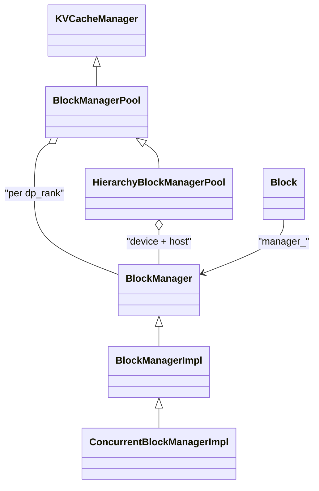

# Block 管理架构设计总结

## 一、目录与职责概览

| 文件 | 职责 |
|------|------|
| [block.h](block.h) / [block.cpp](block.cpp) | 块实体：id、引用计数、hash、与 Manager 绑定 |
| [block_manager.h](block_manager.h) | 块管理抽象接口（分配/释放/共享/缓存/统计） |
| [block_manager_impl.h](block_manager_impl.h) / [block_manager_impl.cpp](block_manager_impl.cpp) | 单设备块管理实现：空闲列表 + PrefixCache |
| [concurrent_block_manager_impl.h](concurrent_block_manager_impl.h) / [concurrent_block_manager_impl.cpp](concurrent_block_manager_impl.cpp) | 线程安全包装：对 Impl 加 mutex |
| [kv_cache_manager.h](kv_cache_manager.h) | 以 Sequence/Request 为粒度的 KV 缓存管理抽象 |
| [block_manager_pool.h](block_manager_pool.h) / [block_manager_pool.cpp](block_manager_pool.cpp) | 多 DP rank 的 BlockManager 池，实现 KVCacheManager |
| [hierarchy_block_manager_pool.h](hierarchy_block_manager_pool.h) / [hierarchy_block_manager_pool.cpp](hierarchy_block_manager_pool.cpp) | 设备+主机双层块池，支持 offload/prefetch/transfer |

---

## 二、分层与继承关系



- **KVCacheManager**：顶层抽象，面向 Request/Sequence 的分配、释放、共享、缓存、transfer/prefetch 等。
- **BlockManagerPool**：实现 KVCacheManager，内部持有一组 **BlockManager**（按 `dp_rank` 分），负责选 rank、按 token 数算块数、beam search 交换等。
- **BlockManager**：单“逻辑设备”上的块管理接口；**BlockManagerImpl** 用 `free_blocks_` + 可选 **PrefixCache** 实现；**ConcurrentBlockManagerImpl** 在 Impl 外再包一层 mutex。
- **Block**：由某个 BlockManager 分配，通过引用计数与 `manager_->free(id_)` 绑定生命周期。

---

## 三、核心抽象说明

### 3.1 Block（块实体）

- **id_**：块 ID；0 保留为 padding。
- **ref_count_**：引用计数；归零时在析构/赋值中调用 `manager_->free(id_)`，块归还管理器。
- **hash_value_**：用于 Prefix Cache 的链式 hash（当前块 + 前序块），见 `get_immutable_hash_value` / `set_hash_value`。
- **size_**：从 `BlockManager::block_size()` 取得，表示每块可放多少 token。

拷贝/移动语义：拷贝增加引用计数；移动将原 Block 置为无效（id=-1, ref_count_=nullptr），不改变总引用数。

### 3.2 BlockManager（单设备块管理接口）

- **allocate(num_blocks)** / **allocate()**：从空闲列表取块；不足时若开启 prefix cache 会先 **evict** 再分配。
- **deallocate(blocks)**：不直接还块，只更新 **num_used_blocks_**；实际还块由 **Block 析构时 ref_count 归零 → free(block_id)** 完成。
- **allocate_shared(tokens_ids, existed_shared_blocks)**：前缀匹配，从 PrefixCache 拿到可共享的块并更新 num_used_blocks_。
- **cache(token_ids, blocks)** / **cache(blocks)**：把块插入 PrefixCache，供后续 allocate_shared 匹配。
- **free(block_id)**：把 block_id 放回 **free_blocks_** 并增加 **num_free_blocks_**（Block 析构时调用）。
- **get_merged_kvcache_event**：汇总 PrefixCache 的 upload 相关事件（如 removed_cache / stored_cache）。

配置通过 **Options**：num_blocks、block_size、enable_prefix_cache、enable_disagg_pd、enable_cache_upload。

### 3.3 BlockManagerImpl 内部结构

- **free_blocks_**：栈式空闲块 ID 列表；分配从尾部取，释放时放回。
- **num_free_blocks_** / **num_used_blocks_**：原子计数，用于快速判断容量与利用率。
- **prefix_cache_**：可选；**has_enough_blocks** 中若空闲不足会先 `prefix_cache_->evict(n)` 再分配；**allocate_shared** 调用 `prefix_cache_->match`；**cache** 调用 `prefix_cache_->insert`。

### 3.4 BlockManagerPool（多 rank 池）

- **block_managers_**：`vector<unique_ptr<BlockManager>>`，长度 = dp_size；根据 `enable_disagg_pd` / `enable_kvcache_store` 选择 **BlockManagerImpl** 或 **ConcurrentBlockManagerImpl**。
- **get_dp_rank(sequence)**：若 sequence 未绑定则选 **get_manager_with_max_free_blocks()** 并写入 sequence。
- **allocate(sequence, num_tokens)**：先 **allocate_shared(sequence)**，再按 token 数算所需块数；若不足则 **process_beam_search**（可能分配 1 块做 swap）；最后从对应 rank 的 BlockManager **allocate** 并 **sequence->add_kv_blocks**。
- **deallocate(sequence)**：先 **cache(sequence)** 写入 prefix cache，再 **deallocate(sequence->kv_blocks())**，最后 **sequence->reset()**。
- **swap_block_transfer_infos_**：按 dp_rank 记录 beam search 的块交换信息（src_block_id → dst_block_id），供外部做实际 KV 拷贝。

### 3.5 HierarchyBlockManagerPool（设备 + 主机双层）

- 继承 **BlockManagerPool**，在原有 **block_managers_**（设备）基础上增加 **host_block_managers_**（主机）。
- **allocate(sequence, num_tokens)**：先调 **BlockManagerPool::allocate** 在设备上分配；若主机侧尚无块且非 DECODE，则 **allocate_host_shared(sequence)**；再根据主机/设备已缓存 token 数生成 **load_block_transfer_infos_**（H2D），并更新 sequence 的 kv_cache_tokens_num。
- **allocate(sequence, num_tokens, max_copy_in_blocks_num)**：在满足 `max_copy_in_blocks_num` 约束下做设备分配与 H2D 的 copy-in 计划。
- **deallocate(sequence)**：若主机块数 ≥ 设备块数，先释放主机块再释放设备块；否则先补分配主机块，再构造 **OffloadBlockPair**（设备块→主机块）放入 **offload_block_pair_queues_**，最后统一释放并 **cache** 主机侧。
- **transfer_blocks**：先按 **load_block_transfer_infos_** 做 H2D；再消费 **offload_block_pair_queues_** 做 D2H/offload，异步完成后对设备块 **deallocate**、对主机块 **cache** 再 **deallocate**。
- **prefetch_from_storage** / **update_prefetch_result**：在 enable_kvcache_store 时从存储预取到主机、匹配 prefix 并 **cache** 主机块；与 Engine 协作。

---

## 四、数据流简图

```mermaid
sequenceDiagram
  participant Seq as Sequence
  participant Pool as BlockManagerPool
  participant Mgr as BlockManagerImpl
  participant PC as PrefixCache
  participant Block as Block

  Seq->>Pool: allocate(sequence, num_tokens)
  Pool->>Pool: get_dp_rank / allocate_shared
  Pool->>Mgr: allocate_shared(tokens) / allocate(n)
  Mgr->>PC: match() / evict if needed
  PC-->>Mgr: shared_blocks
  Mgr->>Block: new Block(id, this)
  Mgr-->>Pool: blocks
  Pool->>Seq: add_kv_blocks(blocks)

  Note over Seq,Block: ... 使用 blocks ...

  Seq->>Pool: deallocate(sequence)
  Pool->>Mgr: cache(sequence); deallocate(blocks)
  Mgr->>PC: insert(token_ids, blocks)
  Note over Block: Block 析构 ref_count→0
  Block->>Mgr: free(block_id)
  Mgr->>Mgr: free_blocks_.push(block_id)
```

---

## 五、设计要点归纳

1. **块生命周期**：由 Block 的引用计数驱动；只有 ref_count 归零才调用 `manager_->free(block_id)`，保证同一块在多处共享（如 prefix cache）时不会重复回收。
2. **Prefix Cache 与驱逐**：开启后，分配不足时先 evict 再分配；释放时先 cache 再 deallocate，便于后续 allocate_shared 匹配前缀，提高命中率。
3. **多 rank 策略**：Pool 按 dp_rank 分片管理块；无绑定时按“当前空闲块最多”的 rank 分配，均衡负载。
4. **并发**：仅在 disagg_pd 或 kvcache_store 场景使用 **ConcurrentBlockManagerImpl**，其余单线程用 **BlockManagerImpl**。
5. **层级扩展**：**HierarchyBlockManagerPool** 通过设备/主机两套 BlockManager + **BlockTransferInfo**（H2D/D2G 等）与 **OffloadBlockPair** 队列，把块在设备、主机、存储之间迁移与预取，与 Engine 的 transfer/prefetch 接口配合。

整体上，该目录实现了从“单块引用与回收”到“多 rank、多层级、可前缀共享”的 KV Cache 块管理架构，与 request/sequence、prefix_cache、kv_cache_store、engine 等模块协同工作。
