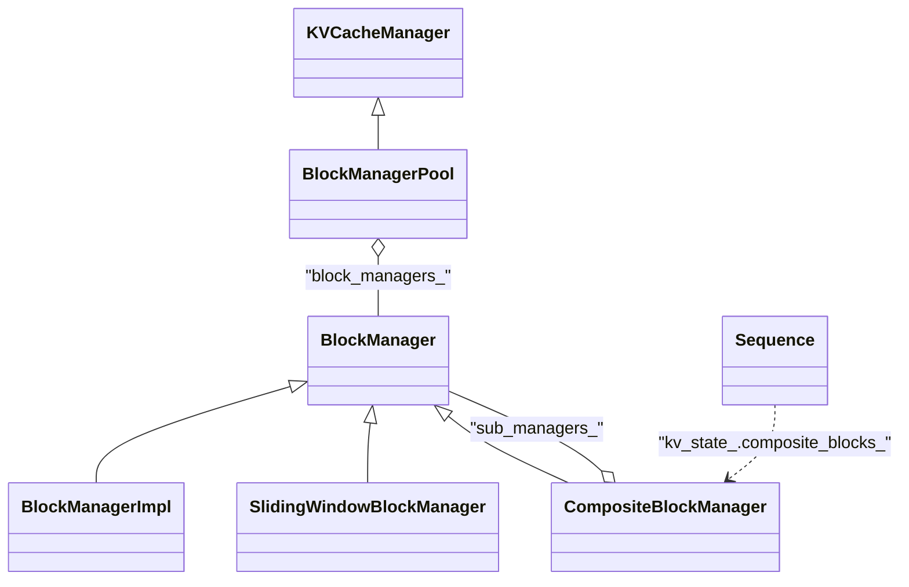

# CompositeBlockManager 与特殊 BlockManager 实现计划

## 一、目标与约束

- **CompositeBlockManager**：由多种 BlockManager 组成；allocate 时对同一 Sequence 在多个 sub-manager 上分配，结果按 manager 索引记录到 Sequence 的额外字段。
- **两种 sub-manager 类型**：
  1. 多个 **BlockManagerImpl**：各自不同 `block_size` / `num_blocks`（现有实现复用）。
  2. **SlidingWindowBlockManager**：每 Sequence 固定分配 `window_size` 个 block（创建时固定）。
- **KVCacheState**：新增字段 `composite_blocks_`，按「manager 索引」记录各 sub-manager 分配的 blocks，在 `KVCacheState::reset()` 中清空；通过 `sequence->kv_state()` 访问，与现有 `blocks_`（kv_blocks）一致，Block 相关状态统一放在 KVCacheState 中。
- 与现有 **KVCacheManager** / **BlockManagerPool** 的对接方式需明确（见下文「对接方式」）。

---

## 二、架构关系（示意）

（`composite_blocks_` 存放在 **KVCacheState** 中，Sequence 通过 `kv_state()` 暴露。）

- **BlockManagerPool** 实现 **KVCacheManager**，持有 `block_managers_`（多个 **BlockManager**）；每个 slot 可以是 **BlockManagerImpl**、**ConcurrentBlockManagerImpl**，或 **CompositeBlockManager**。
- **CompositeBlockManager** 实现 **BlockManager**（与 BlockManagerImpl 同级），由 Pool 像其他 BlockManager 一样管理；内部持有 `sub_managers_`（多种 BlockManager）。
- **SlidingWindowBlockManager** 实现 **BlockManager**，作为 Composite 的 sub-manager；具体分配逻辑封装在各自类的 `allocate_for_sequence` 中。

---

## 三、KVCacheState 扩展（Block 统一放在 KVCacheState 中）

**文件**：`xllm/core/framework/request/sequence_kv_state.h`、`sequence_kv_state.cpp`

**方案**：与现有 `blocks_`（即 `kv_blocks()`）一致，将「按 composite manager 索引」的块列表也放在 **KVCacheState** 中，便于所有 Block 相关状态集中管理。

- 在 **KVCacheState** 中新增成员：
  - `std::vector<std::vector<Block>> composite_blocks_`
  - 含义：`composite_blocks_[i]` = 第 i 个 sub-manager 为该 Sequence 分配的 blocks。
- 配套方法（在 KVCacheState 中）：
  - `std::vector<std::vector<Block>>* mutable_composite_blocks()` / `const std::vector<std::vector<Block>>& composite_blocks() const`
  - 在 **KVCacheState::reset()** 中清空 `composite_blocks_`（与 `blocks_`、`src_blocks_` 等一并清理）；Sequence 侧无需改 reset()，因已调用 `kv_state_.reset()`。
- **访问方式**：CompositeBlockManager 及 Pool 通过 `sequence->kv_state().composite_blocks()` / `sequence->kv_state().mutable_composite_blocks()` 读写。
- **主 cache 与兼容性**：若 Composite 的「主」KV 来自某一固定 sub-manager（例如 index 0），可由 CompositeBlockManager 在分配后把该 manager 的 blocks 同步写入 `sequence->kv_state_`（即 `add_kv_blocks`），这样现有 scheduler/executor 仍只读 `kv_state().kv_blocks()` 即可；其余 manager 的 blocks 仅存在于 `kv_state().composite_blocks_`。

---

## 四、SlidingWindowBlockManager

- **职责**：每 Sequence 固定分配 **window_size** 个 block；不关心具体是哪个 Sequence，由上层（Composite）保证「每个 Sequence 只对该 manager 请求一次 window_size 的分配」。
- **实现方式**：复用现有 **BlockManagerImpl** 的 allocate/deallocate/free 逻辑，仅约束「单次分配量」为 `window_size`。
  - 可继承 **BlockManagerImpl**，构造时传入 `num_blocks`、`block_size`、`window_size`；重写 **allocate(size_t n)**：若 `n != window_size` 可 CHECK 或返回空；否则 `return BlockManagerImpl::allocate(window_size)`。
  - 或单独实现：内部持有一个 `BlockManagerImpl`（或相同逻辑的 free_blocks_ + block_size），`allocate(n)` 仅当 `n == window_size` 时分配并返回。
- **接口**：仅需实现 **BlockManager** 接口；不需要 Sequence 指针。Composite 侧对该 slot 只调用一次 `allocate(window_size)` 并把结果写入 `sequence->kv_state().mutable_composite_blocks()->at(slot)`（或先 resize 再写入）。

**文件**：新建 `sliding_window_block_manager.h` / `sliding_window_block_manager.cpp`，放在 `xllm/core/framework/block/` 下。

---

## 五、CompositeBlockManager（实现 BlockManager，由 Pool 管理）

- **职责**：实现 **BlockManager**，由 **BlockManagerPool** 在 `block_managers_` 中持有；内部持有多个 **BlockManager**（BlockManagerImpl、SlidingWindowBlockManager）。Pool 通过 `is_composite()` 分支调用本类的 **allocate_for_sequence** / **deallocate_sequence**，本类在多个 sub-manager 上统一按「按 Sequence 分配」语义协同分配/释放，结果写入 **Sequence 的 kv_state** 中的 `composite_blocks_`。
- **配置**：SubManagerSpec 等描述每个 slot 的类型与参数；构造时创建各 sub-manager 放入 `sub_managers_`。
- **allocate_for_sequence(seq, num_tokens)**（重写 BlockManager 的同一接口）：
  - 对每个 slot i 统一调用 `blocks = sub_managers_[i]->allocate_for_sequence(seq, num_tokens)`（各 sub-manager 内部封装自己的逻辑：Normal 按 token 数、SlidingWindow 固定 window_size），将结果写入 `seq->kv_state().mutable_composite_blocks()`（需保证 size 至少为 sub_managers_.size()，再写第 i 项）。若某 slot 已为该 sequence 分配过且不需补足（如 SlidingWindow），由各 sub-manager 的 `allocate_for_sequence` 实现决定返回已有 blocks 或新分配。
  - 主 cache 同步：若约定 slot 0 为主 KV，将 `kv_state().composite_blocks()[0]` 通过 `sequence->add_kv_blocks(...)` 同步到 `kv_state_` 的 `blocks_`。
- **deallocate_sequence(seq)**：对每个 i 调用 `sub_managers_[i]->deallocate(seq->kv_state().composite_blocks()[i])`；不在此处调用 `sequence->reset()`，由 Pool 统一调用。
- **BlockManager 其他接口**：如 `block_size()`、`num_total_blocks()`、`num_free_blocks()` 等可聚合主 slot 或各 sub-manager。

**文件**：新建 `composite_block_manager.h` / `composite_block_manager.cpp`，依赖 `block_manager.h`、Sequence 与 request 头文件。

---

## 六、BlockManager 接口扩展（统一「按 Sequence 分配」）

- 所有 BlockManager 的语义都是「为某个 Sequence 分配 blocks」，具体逻辑（按 token 数、固定 window_size 等）封装在各自类内部。
- 在 `block_manager.h` 中只增加统一的「按 Sequence 分配」入口及 Composite 与 Pool 的协作接口：
  - **`virtual bool is_composite() const { return false; }`**  
    CompositeBlockManager 重写为 true；Pool 据此分支，对 composite 调用 allocate_for_sequence / deallocate_sequence。
  - **`virtual std::vector<Block> allocate_for_sequence(Sequence* seq, size_t num_tokens)`**  
    默认实现：`return allocate((num_tokens + block_size() - 1) / block_size());`  
    - **BlockManagerImpl**：不重写，使用默认。  
    - **SlidingWindowBlockManager**：重写为 `return allocate(window_size);`（逻辑封装在类内）。  
    - **CompositeBlockManager**：重写为对每个 sub_managers_[i] 调用 `allocate_for_sequence(seq, num_tokens)`，将结果写入 `sequence->kv_state().mutable_composite_blocks()` 的第 i 项，并可选同步主 slot 到 `sequence->add_kv_blocks`。
  - **`virtual void deallocate_sequence(Sequence* seq) {}`**  
    默认空；仅 CompositeBlockManager 实现：按 `sequence->kv_state().composite_blocks()` 对每个 sub_manager 调用 `deallocate(blocks)`。
- **BlockManagerImpl**、**ConcurrentBlockManagerImpl** 不重写；**SlidingWindowBlockManager** 只重写 `allocate_for_sequence`，封装策略。

---

## 七、对接方式与依赖

- **使用方**：**BlockManagerPool** 的创建处（如 Engine）在构造 Pool 时，可将某一 dp_rank 的 `block_managers_[rank]` 设为 **CompositeBlockManager** 实例（与当前填入 BlockManagerImpl / ConcurrentBlockManagerImpl 的方式一致）；无需替换整个 KVCacheManager，只需在创建 `block_managers_` 时按配置插入 CompositeBlockManager 即可。
- **依赖**：CompositeBlockManager 依赖 KVCacheState 的 `composite_blocks_`，故需先在 sequence_kv_state 中扩展并已在 KVCacheState::reset() 中清空；SlidingWindowBlockManager 仅依赖 block 与 BlockManager，可与 Composite 同批或先行。
- **测试**：为 CompositeBlockManager、SlidingWindowBlockManager 各写单元测试；并测试 Pool 在某一 rank 使用 CompositeBlockManager 时的 allocate(sequence, num_tokens) / deallocate(sequence) 路径。

---

## 八、实现顺序建议

1. **KVCacheState 扩展**：在 `sequence_kv_state.h/cpp` 中增加 `composite_blocks_` 及访问器，在 **KVCacheState::reset()** 中清空。
2. **BlockManager 接口扩展**：增加 `is_composite()`、`allocate_for_sequence(seq, num_tokens)`、`deallocate_sequence(seq)` 默认实现；各子类只重写 `allocate_for_sequence` 封装自身逻辑。
3. **SlidingWindowBlockManager**：实现 BlockManager，重写 `allocate_for_sequence` 为 `return allocate(window_size);`，接入 CMakeLists。
4. **CompositeBlockManager**：实现 BlockManager（含 is_composite/allocate_for_sequence/deallocate_sequence），对每个 sub_manager 统一调用 `allocate_for_sequence(seq, num_tokens)`，写入 `seq->kv_state().mutable_composite_blocks()` 并可选同步主 slot 到 kv_state_ 的 blocks_。
5. **BlockManagerPool 改动**：在 allocate(sequence, num_tokens) 与 deallocate(sequence) 中根据 `is_composite()` 分支调用 `allocate_for_sequence` / `deallocate_sequence`。
6. **集成与测试**：在创建 block_managers_ 的路径中支持配置 CompositeBlockManager，并补充单测。

---

## 九、要点小结

- **CompositeBlockManager** 是 BlockManager 的一种，由 **BlockManagerPool** 在 `block_managers_` 中管理。
- **KVCacheState** 新增 `composite_blocks_`，在 **KVCacheState::reset()** 中清空；仅当某 rank 使用 CompositeBlockManager 时由 Composite 通过 `sequence->kv_state()` 读写。
- 所有 BlockManager 统一通过 **allocate_for_sequence(seq, num_tokens)** 表达「为 Sequence 分配 blocks」，具体逻辑封装在各自类内：BlockManagerImpl 默认按 token 数；SlidingWindowBlockManager 固定 window_size。
- **BlockManager** 仅增加 `is_composite()`、`allocate_for_sequence`、`deallocate_sequence`；**BlockManagerPool** 根据 `is_composite()` 分支调用；**CompositeBlockManager** 对每个 sub_manager 统一调用 `allocate_for_sequence`，结果写入 **KVCacheState** 的 `composite_blocks_`，主 cache 可选择性同步到 `kv_state_` 的 `blocks_`。
